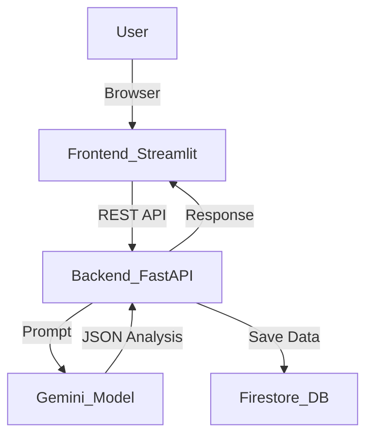

# DeadIdea AI 

DeadIdea AI is a multimodal AI agent that analyzes failed startups, discontinued products, and abandoned innovations to determine whether they could succeed today. It fulfills the requirements for the **Gemini Live Agent Challenge Hackathon**, competing in the **Creative Storyteller** category.

## Project Overview
Historically, many brilliant ideas failed purely because the timing was wrong—the technology wasn't there, internet speeds were too slow, or the market wasn't ready. This app uses the **Google Gemini Model** to step thoughtfully into the "idea graveyard", dig up discarded ideas, and reimagine them for the modern technological landscape.

## Features
1. **Idea Input Interface**: Enter any failed product (e.g., Google Glass, Vine).
2. **Failure Analysis**: AI analyzes the historical failure reasons.
3. **Modern Technology Mapping**: AI identifies what has changed (AI, 5G, AR/VR, shifting user habits).
4. **Revived Startup Concept**: AI proposes a completely modernized startup pitch.
5. **Revival Potential Score**: Rates the new concept from 0-100.
6. **Multimodal Output**: Not only generates text analysis, but produces an AI-image prompt and dynamically displays a generated visual of the new concept!
7. **Idea Database**: Connects to Google Cloud Firestore to save historical analyses.

##  Tech Stack
- **AI**: Google Gemini (via `google-generativeai` SDK)
- **Backend API**: Python FastAPI
- **Frontend**: Streamlit
- **Database**: Google Cloud Firestore
- **Deployment**: Google Cloud Run / Docker

##  Architecture


##  Setup Instructions (Local)

1. Clone the repository
2. Install dependencies:
   ```bash
   pip install -r requirements.txt
   ```
3. Set your Gemini API key:
   - On Windows: `set GEMINI_API_KEY=your_key_here`
   - On Mac/Linux: `export GEMINI_API_KEY=your_key_here`
4. (Optional) Set up Google Cloud Credentials locally for Firestore:
   ```bash
   gcloud auth application-default login
   ```
5. Run the services using the start script:
   - Command: `bash start.sh`
   - Or run separately:
     - Term 1: `uvicorn backend.main:app --reload`
     - Term 2: `streamlit run frontend/app.py`

##  Deployment Instructions (Google Cloud Run)

This app is containerized and ready to deploy to Cloud Run!

1. Install Google Cloud CLI (`gcloud`).
2. Login and set your project:
   ```bash
   gcloud auth login
   gcloud config set project YOUR_PROJECT_ID
   ```
3. Deploy to Cloud Run (One-liner):
   ```bash
   gcloud run deploy deadidea-ai --source . --region us-central1 --allow-unauthenticated --set-env-vars="GEMINI_API_KEY=your_actual_key_here"
   ```
   *Cloud Run automatically builds the Dockerfile and deploys both FastAPI and Streamlit on the same container!*

##  Demo Instructions

For your 4-minute demo capability, try the following scenario:

1. **Introduction (1 min)**: Explain the concept of DeadIdea. Open the hosted web interface.
2. **First Example - Google Glass (1.5 min)**:
   - Enter `Google Glass` and click Analyze.
   - Show the summary and the AI’s explanation of why it failed (poor battery, weird social acceptance, lack of use-cases).
   - Show how Gemini maps it to today: lightweight AR, Ray-Ban Meta glasses, AI-agent integrations.
   - Show the generated Revived Concept and the generated **Multimodal image visualization**! Review the Score.
3. **Second Example - Vine (1 min)**:
   - Enter `Vine`.
   - Show the output where it talks about TikTok and Short-form video domination, and propose how a modernized Vine might thrive right now on highly curated AI-edited micro-content.
4. **Architecture & Stack (0.5 min)**: Show the DB history expanding via the History accordion at the bottom, proving Firestore integration. Highlight Cloud Run scaling and Gemini API structured JSON mode.
